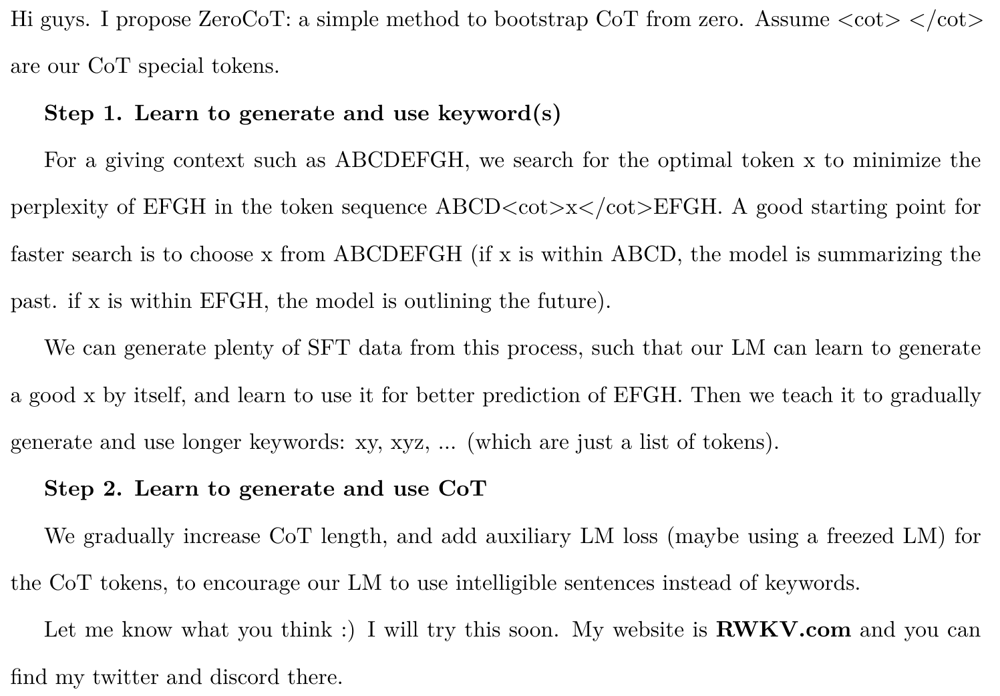

## 本项目来源于 [PENG Bo](https://github.com/BlinkDL) 的 [idea](https://github.com/RWKV/ZeroCoT)



> ### 中文翻译
> **第一步：学习生成并使用关键词**
>
>   对于给定的上下文（如 `ABCDEFGH`），我们搜索最优的标记 `x`，以最小化序列 `ABCD <cot> x </cot> EFGH` 中 `EFGH` 的困惑度。为了加速搜索，`x` 可以从 `ABCDEFGH` 中选择（如果 `x` 在 `ABCD` 中，模型正在总结过去；如果 `x` 在 `EFGH` 中，模型正在规划未来）。
>
>   通过此过程生成大量监督微调（**SFT**）数据，使模型学会自动生成有效的 `x`，并利用它更好地预测EFGH。接着，逐步教会模型生成和使用更长的关键词（如 `xy`、`xyz` 等，即一系列标记）。
>
> **第二步：学习生成并使用完整的CoT**
>
>   逐步增加 **CoT** 的长度，并添加辅助损失（可能通过冻结的语言模型），以鼓励模型生成可理解的句子而非关键词。

## 使用方法
### （一）搭建环境：
``` bash
python -m venv zore_cot_test
source zore_cot_test/bin/activate
```
之后安装 [`PyTorch`](https://pytorch.org/get-started/) 即可

### (二) 准备数据：
按照`testdata.txt`的格式组织数据
``` 
Tokens 1 xxxxxxxxxxxxxxxxxxxxxxxxxxxxxx

Tokens 2 yyyyyyyyyyyyyyyyyyyyyyyyyyyyyy

Tokens 3 zzzzzzzzzzzzzzzzzzzzzzzzzzzzzz

...
```

### (三) 运行：
``` python
python ZoreCoT.py
```

## 项目进展 | Project Progress  

- [ ] **实现步骤一 | Implementation Step One**  
  - [x] **实现搜索逻辑 | Implement the search logic** 
  - [x] **可视化搜索结果 | Visualize Search Results**  
  - [ ] **导出 KoT (Keywords of Thought) 结果 | Export KoT (Keywords of Thought) Results**  
  - [ ] **扩展语言类型 | Expand  Language type**
  - [ ] **从 关键字 (Keyword) 搜索，扩展 关键词 (Keywords) 搜索 | Expand from Keyword Search to Keywords Search**  

<!-- - [ ] **实现步骤二 | Implementation Step Two**  
  - [ ] **关键词的人类对齐 | Human Alignment of Keywords**  
  - [ ] **训练管线 | Training Pipeline**   -->